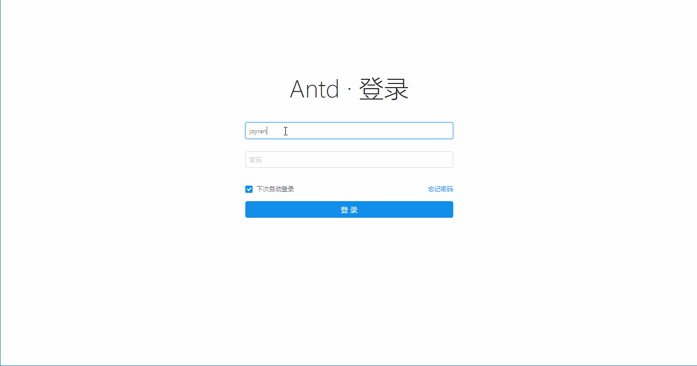

Ant Design 后台模板，前端采用 react + redux + react router + antd + webpack 技术栈，后端采用 node.js + mongodb 技术栈，后端接口遵循 RESTful API 设计规范

## 环境要求
- node.js > 7.6.0
- mongodb > 3.4.5

## 演示


## 开始使用
### 1.启动mongodb：
`mongod --dbpath f:/mongodb/data/db --auth`, 强烈建议开启鉴权, f:/mongodb/data/db 为 mongodb 数据库存放路径。

##### 开启鉴权方法如下：
###### 1.不带鉴权 --auth 启动数据库
`mongod --dbpath f:/mongodb/data/db`

###### 2.创建用户
2.1 启动 mongo 客户端 ./mongo

2.2 `use admin`

2.3 新建个用户 admin, 权限为管理所有数据库，但没有其它数据库的读写权限
    `db.createUser({user:"admin", pwd:"root", roles:[{roles:"userAdminAnyDatabase", db:"admin"}]})`

2.4 `use antd`

2.5 在 antd 数据库下创建一个具有读写权限的用户
    `db.createUser({user:"antd", pwd:"123456", roles:[{role:"readWrite", db:"antd"}]})`

###### 3.带鉴权 --auth 启动数据库
`mongod --dbpath f:/mongodb/data/db --auth`

###### 4.重新连接
4.1 `use antd`

4.2 `db.auth('antd','123456')`

4.3 `db.users.find()`

### 2.根据需要修改配置文件 config/production.json 中 mongodb 参数

```json
{
  "mongodb": {
    "host": "localhost",
    "port": "27017",
    "database": "antd",
    "username": "antd",
    "password": "123456"
  }
}
```

### 3.导入测试数据库
- `mongoimport -u antd -p 123456 -d antd -c users --file database/users.json --type json`
- `mongoimport -u antd -p 123456 -d antd -c menus --file database/menus.json --type json`
- `mongoimport -u antd -p 123456 -d antd -c columns --file database/columns.json --type json`
- `mongoimport -u antd -p 123456 -d antd -c articles --file database/articles.json --type json`


**集合字段说明如下**：

- users: 用户集合
  - `_id`: 自动索引
  - uid: 用户id
  - username: 姓名
  - password: MD5 加密后的密码
  - mail: 邮箱
  - avatar: 头像地址
  - state: 状态，可用/禁用
  - sex: 性别
  - age: 年龄
  - birthday: 出生日期，unix时间戳格式
  - phone: 电话号码
  - createAt: 创建日期，unix时间戳格式
- sessions: session 集合，不需要手动创建，第一次登录成功后会自动创建
- menus: 菜单栏
  - `_id`: 自动索引
  - key
  - pkey: 父级菜单 key
  - icon: 图标
  - title: 显示标题
  - link: 链接，如/dashboard
- columns: datagrid columns 字段，每一个 datagrid 对应一个 document
  - `_id`: 自动索引
  - table: datagrid 表格名称
  - columns: 字段数组
    - title: 显示标题
    - dataIndex:
    - errorMessage: 填写表单时验证消息
    - required: 字段是否必填
    - type: 字段类型，同 ant design 组件名，比如 Input, InputNumber
    - value: 不需要填写
    - width: 宽带，百分比
    - disabled: 是否禁止编辑

### 4.创建 datagrid 数据集合
比如 menus 中有 article 文章管理，则需要创建一个 articles 集合。
另外还要在 /server/models 中新增一个 article.js 模型，内容如下。

```js
/**
 * 导出 Article model，对应集合为 Articles
 */

// 从 mongoose.js 中导出 mongoose, Schema 两个变量
var { mongoose, Schema } = require('../utils/mongoose')

// 新建 articleSchema
var articleSchema = new Schema({
  title     : String,
  author    : String,
  views     : Number,
  likes     : Number,
  comments  : Number,
  createdAt : String
}, { versionKey: false })

// 根据 articleSchema 新建 Article model，对应集合为 articles
var Article = mongoose.model('Article', articleSchema)

module.exports = Article
```

Schema 中定义的字段一定要和 articles 集合中字段一致，且数据类型也一致，否则该字段无法使用。

在 /server/controllers/api.js 中导入 Article model `var Article = require('../models/article')`
在`getModelByTable`函数中新增 article 判断条件。

```js
// 根据 table 名返回对应的 Model 模型
const getModelByTable = (table) => {
  switch (table) {
    case 'article':
      return Article
      break

    case 'comment':
      return Comment
      break

    default:
      console.error('未匹配到 Model')
      return undefined
      break
  }
}
```

5.`npm install  // 安装依赖包`

6.`npm start   // 开发环境`

7.`npm run build    // 生产环境`

## 目录结构
```tree
├─client                # 前端代码
│  ├─actions            # redux actions
│  ├─components         # react ui 组件
│  │  ├─datagrid        # 数据展示核心表格
│  │  ├─head            # 网站头部横幅
│  │  ├─index           # 后台主页
│  │  ├─login           # 登录
│  │  ├─menus           # 菜单栏
│  │  ├─row-form-modal  # datagrid 新增(create)和更新(update)行模态框
│  │  └─toolbar         # datagrid 工具栏
│  ├─containers         # 容器组件
│  ├─pages              # 页面
│  ├─reducers           # redux reducers
│  └─store              # redux store
├─config                # 配置文件夹
├─database              # 测试数据库
├─logs                  # 日志文件夹
└─server                # 后端代码
    ├─controllers       # 控制器
    ├─middlewares       # 中间件
    ├─models            # 模型
    ├─routers           # 路由
    ├─static            # 静态资源文件
    │  └─dist           # 打包后的js文件
    ├─utils             # 其它
    └─views             # html 文件
└─.babelrc              # babel 配置文件
└─.eslintrc.js          # eslint 配置文件
└─.gitignore
└─app.js                # 后端服务器启动文件
└─package.json
└─README.md
└─webpack.config.js     # webpack 开发环境配置文件
└─webpack.config.prod.js# webpack 生产环境配置文件
```

## Store 设计

- menu: `Array` 菜单
- datagrid: `Mixed` 当前选中被展示的表格
  - selectedTable: `String` 表格名称
  - selectedRowId: `String` 当前选中的行id，值为 mongodb 文档索引 `_id`, 未选中为 null,
  - loading: `Boolean` 是否显示 datagrid 加载遮罩层
  - dataSource: `Array` 根据skip和limit返回的当前展示的数据集合，不是全部数据
    - `_id`: `String` 索引
    - 可变字段:
  - total: `Number` 总行数
  - columns: `Array` 列
    - title: `String` 列头显示文字
    - dataIndex: `String` 列数据在数据项中对应的 key
    - width: `String` 列宽度, 百分比,比如 "10%"
  - pagination: 分页
    - skip: 偏移值
    - limit: 限制值
- rowFormModal: `Mixed` datagrid 新增(create)和更新(update)行模态框
  - visible: `Boolean` 是否可见
  - saveBtnLoading: `Boolean` 保存按钮 loading 状态，保存按钮被点击到返回响应这段时间设为 true
  - title: `String` 模态框 title
  - row: `Array` form 表单值和结构
    - title: `String` FormItem label, 同 columns title
    - dataIndex: `String` FormItem key，同 columns dataIndex
    - errorMessage: `String` 校验文案
    - required: `Boolean` 是否必填
    - type: `String` 子组件类型，可能的值有 Input, InputNumber, Select, DatePicker, Checkbox 等
    - value: `String` 表单值
    - disabled: `Boolean`
- global: `Mixed` 全局 state
  - me: `String` 当前登录用户姓名
  - siderCollapsed: `Boolean` sider 收起标识
  - menuSelectedKey: `String` 当前选中的菜单项 key
- router: 路由相关


## Reducer 设计

- menu: 菜单
- datagrid: 展示表格
- rowFormModal: datagrid 新增(create)和更新(update)行模态框
- global: 全局
- login: 登录
